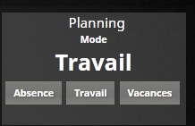
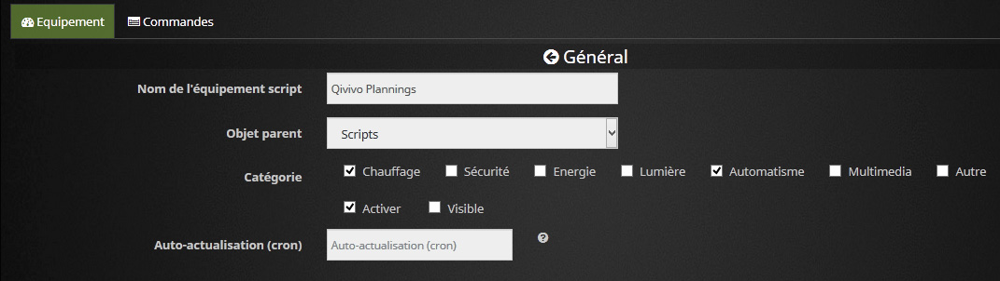
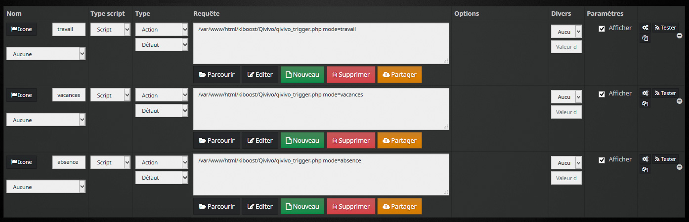
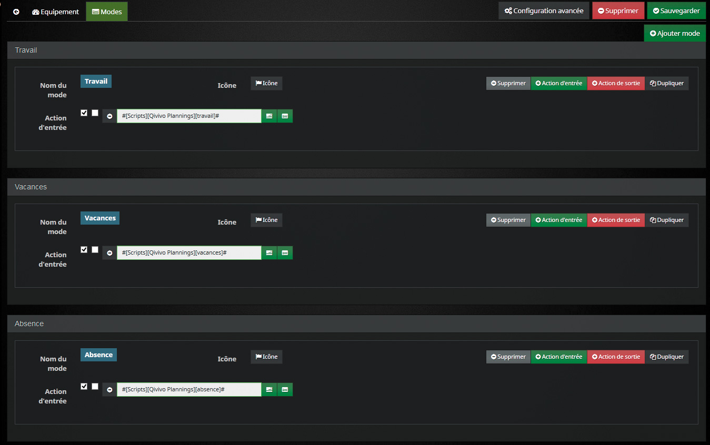

<br>
# php-qivivoAPI - Jeedom

## Utilisation avec Jeedom

Voici un exemple d'utilisation de php-qivivoAPI avec Jeedom, afin d'automatiser vos changements de plannings multi-zone !

L'objectif consiste à créer un Script avec des appels différents par planning. Le Script va ensuite utiliser l'API pour changer directement vos plannings, en fonction du Plugin Mode par exemple ou d'un Virtuel avec des commandes, ou depuis un scénario, etc.

### Attention
Il vous faudra quand même quelques connaissances en php, car vous aurez forcément à adapter le script que nous allons créer en fonction du nombre de zones, du nombre de plannings souhaités, et bien sur de vos horaires.

Cela va donc consister à:

- Télécharger php-qivivoAPI sur votre Jeedom.
- Créer un Script qui appellera l'API en lui passant vos plannings.
- Facultatif: Créer un Mode correspondant à vos plannings.

Il vous faudra pour çà trois plugins, gratuits:

- Le plugin Outils de développement
- Le plugin Script
- Le plugin Mode, ou le plugin Virtuel (facultatif).

Voici l'affichage avec le plugin Mode sur le Dashboard:

<p align="center"></p>


## Télécharger php-qivivoAPI sur votre Jeedom

- Récupérez le fichier php-qivivoAPI.php
- Sur votre Jeedom, avec le plugin Outils de développement, créez un dossier kiboost et un sous dossier Qivivo à la racine, et mettez le php-qivivoAPI.php  dedans.
- Dans le même répertoire, créez un fichier qivivo_trigger.php

> Vous pouvez mettre les fichiers où bon vous semble, il faudra simplement
> changer les premières ligne du code du Script un peu plus bas. Dans
> cet exemple, son chemin sera donc html/kiboost/Qivivo/php-qivivoAPI.php


## Création du Script

- Rien de compliqué ici, Plugins/Programmation/Script, puis créez un Script en cochant *Activer*. Ici il aura pour nom Qivivo Plannings et pour parent Scripts.

<p align="center"></p>

Créez ensuite autant de commandes que de plannings. Un planning comprendra votre zone thermostat et les autres zones.

> Vous pouvez nommer les commandes comme vous voulez, et adapter le code plus bas pour correspondre.
> Chaque commande appellera le même script (qivivo_trigger.php crée plus haut), en lui passant le paramètre mode pour lui indiquer quel planning il doit attribuer à Qivivo.

<p align="center"></p>


## Création des plannings

Avant de créer les plannings, il nous faut d'abord connaitre les zones déclarées dans votre compte Qivivo.
Nous allons donc utiliser le fichier qivivo_trigger.php pour connaitre les noms de nos zones définies dans Qivivo, afin de les appeler ensuite. Cette étape n'est à faire qu'une fois, à la mise en place ;-)

Éditer le fichier qivivo_trigger.php (avec les Outils de Développement ou directement avec le bouton Editer depuis une des commandes).

Coller ceci dedans, en renseignant vos identifiants:

```php
<?php
include('qivivoAPI.php');
include('/var/www/html/core/class/scenario.class.php');

$qivivo_user = 'myqivivologin';
$qivivo_pass = 'myqivivopassword';

//===========initialize API:
log::add('script','error','initializing API...');
$_qivivo = new qivivoAPI($qivivo_user, $qivivo_pass);
if (isset($_qivivo->error))
{
    $error = $_qivivo->error;
    log::add('script','error','ERROR: '.$error);

}
else
{
    $getCurrentProgram = $_qivivo->getCurrentProgram();
    $string = json_encode($getCurrentProgram, JSON_PRETTY_PRINT);
    log::add('script','error',$string);
}
?>
```

Cliquez ensuite sur le bouton Tester à droite d'une des commandes (les trois commandes renvoyant vers le même fichier php)

Regardez alors le log script depuis le menu Analyse/Logs, vous devriez avoir quelque chose comme çà, avec le nom de vos zones et l'identification de la zone par Qivivo:

[2018-01-22 10:40:17][ERROR] : initializing API...
[2018-01-22 10:40:18][ERROR] : {     "result": {         "Zone Thermostat": "thermostat",         "Chambres": "mz_Chambres",     "SdBs": "mz_SdBs"     } }

> Le log est renseigné en ERROR volontairement pour qu'il apparaisse
> quelques soit votre configuration de log.

Nous avons ici trois zones, avec les identifiants thermostat, mz_Chambres, et mz_SdBs. Ce sont ces identifiants que nous utiliserons dans le script final. J'ai effectivement deux zones en plus du thermostat, pour les chambres et les salles-de-bains.

Il reste maintenant à éditer le fichier qivivo_trigger.php, et pré-remplir vos plannings avec votre zone thermostat et toutes vos zones.

Si l'API n'arrive pas à se connecter (serveurs Qivivo en panne par exemple), le script crée un message Jeedom pour vous avertir.

Ensuite, tout se passe dans la fonction switchMode(), c'est ici qu'il faudra adapter les noms de vos plannings (adapter aussi les commandes du Script avec les même noms), et remplir vos plannings. En fin de scripts, $_qivivo->setProgram doit correspondre à vos zones, et vos variables de programmes si vous les avez changé.

```php
<?php
include('qivivoAPI.php');
include('/var/www/html/core/class/scenario.class.php');

$qivivo_user = 'myqivivologin';
$qivivo_pass = 'myqivivopassword';

if (isset($argv)) {
  foreach ($argv as $arg) {
    $argList = explode('=', $arg);
    if (isset($argList[0]) && isset($argList[1])) {
      $_GET[$argList[0]] = $argList[1];
    }
  }
}

$mode = 'travail'; //default mode
if(isset($_GET['mode'])) $mode = $_GET['mode'];

//===========initialize API:
$_qivivo = new qivivoAPI($qivivo_user, $qivivo_pass);
if (isset($_qivivo->error))
{
    $error = $_qivivo->error;
    message::add('Script:qivivo_trigger.php', $error);
}
else
{
    switchMode($mode);
}

//===========actions:
/*
Thermostat zone: 'pres_1', 'pres_2', 'pres_3', 'pres_4', 'confort', 'nuit', 'hg', 'absence'
Other zone: 'mz_comfort', 'mz_comfort_minus_one', 'mz_comfort_minus_two', 'mz_eco', 'mz_frost', 'mz_off'
*/

//Set your own mode names, according to Script commands, and set your own plannings settings!
function switchMode($mode)
{
    global $_qivivo;

    if ($mode=='vacances')
    {
        //zone thermostat:
        $samedi = [['0:0', '4:59', 'nuit'],
                   ['5:0', '10:29', 'pres_4'],
                   ['10:30', '16:59', 'pres_2'],
                   ['17:0', '22:59', 'pres_4'],
                   ['23:0', '23:59', 'pres_3']];
        $masterProgram = [$samedi, $samedi, $samedi, $samedi, $samedi, $samedi, $samedi];

        //zone chambres:
        $dayType2 = [['0:0', '4:29', 'mz_eco'],
                     ['4:30', '6:29', 'mz_comfort_minus_one'],
                     ['6:30', '9:29', 'mz_comfort'],
                     ['9:30', '17:29', 'mz_comfort_minus_two'],
                     ['17:30', '21:59', 'mz_comfort_minus_one'],
                     ['22:0', '23:59', 'mz_eco']];
        $zoneChambresProgram = [$dayType2, $dayType2, $dayType2, $dayType2, $dayType2, $dayType2, $dayType2];

        //zone salles de bain:
        $dayType2 = [['0:0', '5:59', 'mz_eco'],
                     ['6:0', '9:29', 'mz_comfort'],
                     ['9:30', '17:29', 'mz_eco'],
                     ['17:30', '18:59', 'mz_comfort_minus_one'],
                     ['19:0', '21:59', 'mz_comfort'],
                     ['22:0', '23:59', 'mz_comfort_minus_one']];
        $zoneSdBsProgram = [$dayType2, $dayType2, $dayType2, $dayType2, $dayType2, $dayType2, $dayType2];
    }

    if ($mode=='travail')
    {
        //zone thermostat:
        $lundi = [['0:0', '4:59', 'nuit'],
                  ['5:0', '7:59', 'pres_4'],
                  ['8:0', '16:29', 'pres_1'],
                  ['16:30', '19:29', 'pres_4'],
                  ['19:30', '22:59', 'pres_3'],
                  ['23:0', '23:59', 'pres_2'],];
        $mardi = [['0:0', '4:59', 'nuit'],
                  ['5:0', '7:59', 'pres_4'],
                  ['8:0', '18:29', 'pres_2'],
                  ['19:0', '23:59', 'pres_3']];
        $mercredi = [['0:0', '4:59', 'nuit'],
                  ['5:0', '7:59', 'pres_4'],
                  ['8:0', '18:29', 'pres_2'],
                  ['19:0', '23:59', 'pres_3']];
        $jeudi= [['0:0', '4:59', 'nuit'],
                  ['5:0', '7:59', 'pres_4'],
                  ['8:0', '18:29', 'pres_2'],
                  ['19:0', '23:59', 'pres_3']];
        $vendredi = [['0:0', '4:59', 'nuit'],
                  ['5:0', '7:59', 'pres_4'],
                  ['8:0', '18:29', 'pres_2'],
                  ['19:0', '23:59', 'pres_3']];
        $samedi = [['0:0', '4:59', 'nuit'],
                  ['5:0', '7:59', 'pres_4'],
                  ['8:0', '18:29', 'pres_2'],
                  ['19:0', '23:59', 'pres_3']];
        $masterProgram = [$lundi, $mardi, $mercredi, $jeudi, $vendredi, $samedi, $samedi];

        //zone chambres:
        $dayType1 = [['0:0', '4:29', 'mz_eco'],
                     ['4:30', '6:29', 'mz_comfort_minus_one'],
                     ['6:30', '9:29', 'mz_comfort'],
                     ['9:30', '17:29', 'mz_comfort_minus_two'],
                     ['17:30', '21:59', 'mz_comfort_minus_one'],
                     ['22:0', '23:59', 'mz_eco']];
        $dayType2 = [['0:0', '4:29', 'mz_eco'],
                     ['4:30', '6:29', 'mz_comfort_minus_one'],
                     ['6:30', '9:29', 'mz_comfort'],
                     ['9:30', '17:29', 'mz_comfort_minus_two'],
                     ['17:30', '21:59', 'mz_comfort_minus_one'],
                     ['22:0', '23:59', 'mz_eco']];
        $zoneChambresProgram = [$dayType1, $dayType1, $dayType2, $dayType1, $dayType1, $dayType2, $dayType2];

        //zone salles de bain:
        $dayType1 = [['0:0', '4:59', 'mz_eco'],
                     ['5:0', '5:29', 'mz_comfort_minus_one'],
                     ['5:30', '7:44', 'mz_comfort'],
                     ['7:45', '17:29', 'mz_eco'],
                     ['17:30', '18:59', 'mz_comfort_minus_one'],
                     ['19:0', '21:59', 'mz_comfort'],
                     ['22:0', '23:59', 'mz_comfort_minus_one']];
        $dayType2 = [['0:0', '5:59', 'mz_eco'],
                     ['6:0', '9:29', 'mz_comfort'],
                     ['9:30', '17:29', 'mz_eco'],
                     ['17:30', '18:59', 'mz_comfort_minus_one'],
                     ['19:0', '21:59', 'mz_comfort'],
                     ['22:0', '23:59', 'mz_comfort_minus_one']];
        $zoneSdBsProgram = [$dayType1, $dayType1, $dayType2, $dayType1, $dayType1, $dayType2, $dayType2];
    }

    if ($mode=='absence')
    {
        //zone thermostat:
        $dayType1 = [['0:0', '6:59', 'hg'],
                     ['7:0', '18:29', 'absence'],
                     ['18:30', '23:59', 'hg']];
        $masterProgram = [$dayType1, $dayType1, $dayType1, $dayType1, $dayType1, $dayType1, $dayType1];

        //zone chambres:
        $dayType1 = [['0:0', '5:29', 'mz_frost'],
                     ['5:30', '7:59', 'mz_eco'],
                     ['8:0', '19:29', 'mz_frost'],
                     ['19:30', '23:59', 'mz_eco']];
        $zoneChambresProgram = [$dayType1, $dayType1, $dayType1, $dayType1, $dayType1, $dayType1, $dayType1];

        //zone salles de bain:
        $dayType1 = [['0:0', '5:29', 'mz_frost'],
                     ['5:30', '7:59', 'mz_eco'],
                     ['8:0', '19:29', 'mz_frost'],
                     ['19:30', '23:59', 'mz_eco']];
        $zoneSdBsProgram = [$dayType1, $dayType1, $dayType1, $dayType1, $dayType1, $dayType1, $dayType1];
    }

  //once your programs are defined, edit your zones names and programs variable accordingly:
    $setProgram = $_qivivo->setProgram('thermostat', $masterProgram);
    $setProgram = $_qivivo->setProgram('mz_Chambres', $zoneChambresProgram);
    $setProgram = $_qivivo->setProgram('mz_SdBs', $zoneSdBsProgram);
}

?>
```

## Et maintenant ?

Nous avons donc maintenant un Script capable d'alterner les configurations de Qivivo entre trois plannings, *travail* *vacances* ou *absence*. Il reste donc à créer un moyen rapide dans Jeedom de déclencher ces changements. C'est propre à chacun, vous pouvez par exemple créer un Virtuel en reprenant les trois commandes, ou appeler les commandes depuis une Action dans un scenario comme cela:  #[Scripts][Qivivo Plannings][vacances]#

Personnellement, j'utilise le Plugin Mode, compatible avec l'app iOS. Cela permet aussi de vérifier le mode dans un scénario avec un SI pour d'autres actions:
SI #[Maison][Planning][Mode]# == "Vacances"

<p align="center"></p>

:-)

## License

The MIT License (MIT)

Copyright (c) 2018 KiboOst

Permission is hereby granted, free of charge, to any person obtaining a copy
of this software and associated documentation files (the "Software"), to deal
in the Software without restriction, including without limitation the rights
to use, copy, modify, merge, publish, distribute, sublicense, and/or sell
copies of the Software, and to permit persons to whom the Software is
furnished to do so, subject to the following conditions:

The above copyright notice and this permission notice shall be included in all
copies or substantial portions of the Software.

THE SOFTWARE IS PROVIDED "AS IS", WITHOUT WARRANTY OF ANY KIND, EXPRESS OR
IMPLIED, INCLUDING BUT NOT LIMITED TO THE WARRANTIES OF MERCHANTABILITY,
FITNESS FOR A PARTICULAR PURPOSE AND NONINFRINGEMENT. IN NO EVENT SHALL THE
AUTHORS OR COPYRIGHT HOLDERS BE LIABLE FOR ANY CLAIM, DAMAGES OR OTHER
LIABILITY, WHETHER IN AN ACTION OF CONTRACT, TORT OR OTHERWISE, ARISING FROM,
OUT OF OR IN CONNECTION WITH THE SOFTWARE OR THE USE OR OTHER DEALINGS IN THE
SOFTWARE.
